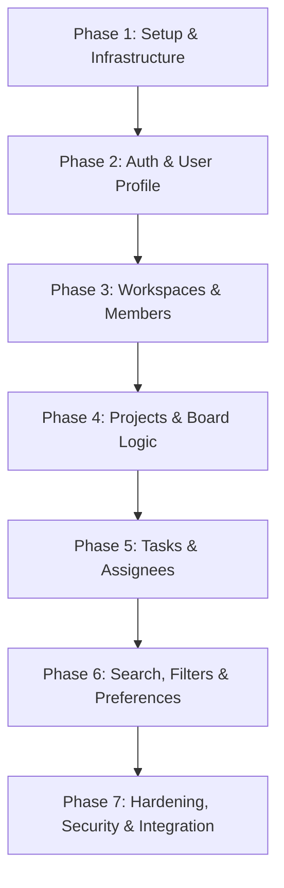

# Polished Backend Specification — NestJS, Prisma & PostgreSQL

> **Project:** Project & Task Management Web Application  
> **Target Stack:** NestJS (Node.js framework), PostgreSQL (Relational DB), Prisma (ORM), JWT (Auth), TypeScript  
> **Status:** Production-Ready Blueprint for Backend Implementation  

---

## 1. Executive Summary & UI Alignment Map

This document outlines the complete, production-grade backend architecture, data model, API contracts, authorization guards, validation rules, and implementation strategy. It has been meticulously aligned with the actual frontend UI implementation (`frontend/app`, `frontend/components`, `frontend/context`).

### Frontend UI Component → Backend API & Schema Mapping

| Frontend UI Component / Page | Key Features / User Actions | Corresponding Backend API Endpoint(s) | Database Entity / Model |
| :--- | :--- | :--- | :--- |
| **`app/page.tsx` (Login / Register)** | User authentication, token issuance, active session fetching | `POST /auth/register`<br>`POST /auth/login`<br>`POST /auth/refresh`<br>`GET /auth/me` | `User`, `WorkspaceMember` |
| **`app/profile/page.tsx`** | View/Edit profile info (name, title, username), Avatar upload, View workspace list & Leave workspace | `GET /users/me`<br>`PATCH /users/me`<br>`PATCH /users/me/avatar`<br>`POST /workspaces/:wId/leave` | `User`, `Workspace`, `WorkspaceMember` |
| **`context/ThemeContext.tsx`** | Theme mode (`light`/`dark`) & Color Mode accents persistence | `PATCH /users/me/preferences` | `User` (preferences JSON) |
| **`components/sidebar.tsx`** | Switch active workspace, list workspaces, navigate routes | `GET /workspaces`<br>`GET /workspaces/:wId` | `Workspace`, `WorkspaceMember` |
| **`app/projects/page.tsx`** | Project listing (List & Board views), Search, Multi-criteria Filtering, Sort, Pagination | `GET /workspaces/:wId/projects`<br>`GET /workspaces/:wId/projects/filters` | `Project`, `ProjectMember`, `ProjectLabel`, `Team`, `Label` |
| **`components/projects/AddProjectModal.tsx`** | Create new project with status, priority, due date, assignees, team, labels, reporter | `POST /workspaces/:wId/projects` | `Project`, `ProjectMember`, `ProjectLabel` |
| **`components/projects/ProjectBoardView.tsx`** | Kanban columns (PLANNED, IN_PROGRESS, COMPLETED), card status drag-and-drop / status update | `PATCH /workspaces/:wId/projects/:id/status`<br>`PATCH /workspaces/:wId/projects/:id/position` | `Project` |
| **`components/projects/FieldsMenu.tsx` & `FilterMenu.tsx`** | Toggle visible columns, store filter criteria, persist user preferences | `GET /workspaces/:wId/view-preferences`<br>`PUT /workspaces/:wId/view-preferences` | `UserViewPreference` |
| **`app/task/page.tsx` & `components/taskHeader.tsx`** | Task Kanban board & Table views, Search tasks, Filter tasks, Create/Edit/Delete tasks | `GET /workspaces/:wId/tasks`<br>`POST /workspaces/:wId/tasks`<br>`PATCH /workspaces/:wId/tasks/:id`<br>`DELETE /workspaces/:wId/tasks/:id` | `Task`, `TaskMember`, `TaskLabel` |
| **`components/breadcrumb.tsx`** | Dynamic navigation paths (Workspace > Project > Task) | Inferred from route resources (`/projects/:id`, `/tasks/:id`) | `Workspace`, `Project`, `Task` |

---

## 2. Complete Production Prisma Schema (`schema.prisma`)

Below is the definitive, copy-pasteable Prisma Schema defining all relations, indexes, enums, and fields required for PostgreSQL.

```prisma
// datasource and generator definitions
datasource db {
  provider = "postgresql"
  url      = env("DATABASE_URL")
}

generator client {
  provider = "prisma-client-js"
}

// ------------------------------------------------------
// Enums
// ------------------------------------------------------

enum Role {
  OWNER
  ADMIN
  MEMBER
}

enum ProjectStatus {
  PLANNED
  IN_PROGRESS
  COMPLETED
}

enum TaskStatus {
  TODO
  DOING
  COMPLETED
}

enum Priority {
  NONE
  URGENT
  HIGH
  MEDIUM
  LOW
}

enum EntityType {
  PROJECT
  TASK
}

enum ViewType {
  LIST
  BOARD
}

// ------------------------------------------------------
// Models
// ------------------------------------------------------

model User {
  id           String   @id @default(uuid())
  email        String   @unique
  passwordHash String
  fullName     String?
  username     String   @unique
  title        String?
  avatarUrl    String?
  theme        String   @default("dark")      // "light" | "dark"
  colorMode    String   @default("emerald")   // "emerald" | "blue" | "purple" | "amber" | "rose" | "default"
  createdAt    DateTime @default(now())
  updatedAt    DateTime @updatedAt
  lastLoginAt  DateTime?

  // Relations
  memberships         WorkspaceMember[]
  createdProjects     Project[]           @relation("ProjectCreator")
  reportedProjects    Project[]           @relation("ProjectReporter")
  createdTasks        Task[]              @relation("TaskCreator")
  reportedTasks       Task[]              @relation("TaskReporter")
  projectMemberships  ProjectMember[]
  taskMemberships     TaskMember[]
  viewPreferences     UserViewPreference[]
  activityLogs        ActivityLog[]

  @@map("users")
}

model Workspace {
  id        String   @id @default(uuid())
  name      String
  slug      String   @unique
  avatarUrl String?
  createdAt DateTime @default(now())
  updatedAt DateTime @updatedAt

  // Relations
  members         WorkspaceMember[]
  projects        Project[]
  tasks           Task[]
  teams           Team[]
  labels          Label[]
  viewPreferences UserViewPreference[]
  activityLogs    ActivityLog[]

  @@map("workspaces")
}

model WorkspaceMember {
  id          String    @id @default(uuid())
  workspaceId String
  userId      String
  role        Role      @default(MEMBER)
  createdAt   DateTime  @default(now())
  updatedAt   DateTime  @updatedAt

  // Relations
  workspace Workspace @relation(fields: [workspaceId], references: [id], onDelete: Cascade)
  user      User      @relation(fields: [userId], references: [id], onDelete: Cascade)

  @@unique([workspaceId, userId])
  @@index([workspaceId])
  @@index([userId])
  @@map("workspace_members")
}

model Team {
  id          String   @id @default(uuid())
  workspaceId String
  name        String
  description String?
  createdAt   DateTime @default(now())
  updatedAt   DateTime @updatedAt

  // Relations
  workspace Workspace @relation(fields: [workspaceId], references: [id], onDelete: Cascade)
  projects  Project[]
  tasks     Task[]

  @@unique([workspaceId, name])
  @@index([workspaceId])
  @@map("teams")
}

model Label {
  id          String   @id @default(uuid())
  workspaceId String
  name        String
  color       String   // Hex code or CSS variable name
  createdAt   DateTime @default(now())
  updatedAt   DateTime @updatedAt

  // Relations
  workspace Workspace      @relation(fields: [workspaceId], references: [id], onDelete: Cascade)
  projects  ProjectLabel[]
  tasks     TaskLabel[]

  @@unique([workspaceId, name])
  @@index([workspaceId])
  @@map("labels")
}

model Project {
  id          String        @id @default(uuid())
  workspaceId String
  name        String
  description String?       @db.Text
  status      ProjectStatus @default(PLANNED)
  priority    Priority      @default(NONE)
  dueDate     DateTime?
  position    Float         @default(0)
  reporterId  String?
  teamId      String?
  createdById String
  createdAt   DateTime      @default(now())
  updatedAt   DateTime      @updatedAt
  deletedAt   DateTime?

  // Relations
  workspace Workspace       @relation(fields: [workspaceId], references: [id], onDelete: Cascade)
  createdBy User            @relation("ProjectCreator", fields: [createdById], references: [id])
  reporter  User?           @relation("ProjectReporter", fields: [reporterId], references: [id])
  team      Team?           @relation(fields: [teamId], references: [id])
  members   ProjectMember[]
  labels    ProjectLabel[]
  tasks     Task[]

  @@index([workspaceId])
  @@index([workspaceId, status])
  @@index([workspaceId, priority])
  @@index([workspaceId, dueDate])
  @@map("projects")
}

model ProjectMember {
  projectId  String
  userId     String
  assignedAt DateTime @default(now())

  // Relations
  project Project @relation(fields: [projectId], references: [id], onDelete: Cascade)
  user    User    @relation(fields: [userId], references: [id], onDelete: Cascade)

  @@id([projectId, userId])
  @@index([projectId])
  @@index([userId])
  @@map("project_members")
}

model ProjectLabel {
  projectId String
  labelId   String

  // Relations
  project Project @relation(fields: [projectId], references: [id], onDelete: Cascade)
  label   Label   @relation(fields: [labelId], references: [id], onDelete: Cascade)

  @@id([projectId, labelId])
  @@index([projectId])
  @@index([labelId])
  @@map("project_labels")
}

model Task {
  id          String     @id @default(uuid())
  workspaceId String
  projectId   String?
  title       String
  description String?    @db.Text
  status      TaskStatus @default(TODO)
  priority    Priority   @default(NONE)
  dueDate     DateTime?
  position    Float      @default(0)
  reporterId  String?
  teamId      String?
  createdById String
  completedAt DateTime?
  createdAt   DateTime   @default(now())
  updatedAt   DateTime   @updatedAt
  deletedAt   DateTime?

  // Relations
  workspace Workspace    @relation(fields: [workspaceId], references: [id], onDelete: Cascade)
  project   Project?     @relation(fields: [projectId], references: [id], onDelete: SetNull)
  createdBy User         @relation("TaskCreator", fields: [createdById], references: [id])
  reporter  User?        @relation("TaskReporter", fields: [reporterId], references: [id])
  team      Team?        @relation(fields: [teamId], references: [id])
  members   TaskMember[]
  labels    TaskLabel[]

  @@index([workspaceId])
  @@index([projectId])
  @@index([workspaceId, status])
  @@index([workspaceId, priority])
  @@map("tasks")
}

model TaskMember {
  taskId     String
  userId     String
  assignedAt DateTime @default(now())

  // Relations
  task Task @relation(fields: [taskId], references: [id], onDelete: Cascade)
  user User @relation(fields: [userId], references: [id], onDelete: Cascade)

  @@id([taskId, userId])
  @@index([taskId])
  @@index([userId])
  @@map("task_members")
}

model TaskLabel {
  taskId  String
  labelId String

  // Relations
  task  Task  @relation(fields: [taskId], references: [id], onDelete: Cascade)
  label Label @relation(fields: [labelId], references: [id], onDelete: Cascade)

  @@id([taskId, labelId])
  @@index([taskId])
  @@index([labelId])
  @@map("task_labels")
}

model UserViewPreference {
  id            String     @id @default(uuid())
  userId        String
  workspaceId   String
  entityType    EntityType
  viewType      ViewType   @default(LIST)
  visibleFields Json       // e.g. ["priority", "members", "dueDate", "status", "teams", "labels", "reporter"]
  createdAt     DateTime   @default(now())
  updatedAt     DateTime   @updatedAt

  // Relations
  user      User      @relation(fields: [userId], references: [id], onDelete: Cascade)
  workspace Workspace @relation(fields: [workspaceId], references: [id], onDelete: Cascade)

  @@unique([userId, workspaceId, entityType])
  @@map("user_view_preferences")
}

model ActivityLog {
  id          String   @id @default(uuid())
  workspaceId String
  actorId     String
  entityType  String   // "PROJECT" | "TASK" | "WORKSPACE"
  entityId    String
  action      String   // "CREATED" | "UPDATED" | "STATUS_CHANGED" | "DELETED"
  metadata    Json?
  createdAt   DateTime @default(now())

  // Relations
  workspace Workspace @relation(fields: [workspaceId], references: [id], onDelete: Cascade)
  actor     User      @relation(fields: [actorId], references: [id], onDelete: Cascade)

  @@index([workspaceId])
  @@index([entityType, entityId])
  @@map("activity_logs")
}
```

---

## 3. NestJS Architecture & Directory Structure

```text
backend/
├── src/
│   ├── main.ts                     # Entry point (Pipes, ExceptionFilters, CORS, Swagger)
│   ├── app.module.ts               # Root module importing all feature modules
│   │
│   ├── auth/                       # Auth module (JWT, Login, Register, Refresh)
│   │   ├── auth.module.ts
│   │   ├── auth.controller.ts
│   │   ├── auth.service.ts
│   │   ├── strategies/             # JwtStrategy, LocalStrategy, RefreshJwtStrategy
│   │   ├── guards/                 # JwtAuthGuard, RefreshAuthGuard
│   │   └── dto/                    # LoginDto, RegisterDto, RefreshTokenDto
│   │
│   ├── users/                      # User profile & theme preferences
│   │   ├── users.module.ts
│   │   ├── users.controller.ts
│   │   ├── users.service.ts
│   │   └── dto/                    # UpdateProfileDto, UpdatePreferencesDto
│   │
│   ├── workspaces/                 # Workspaces & Member management
│   │   ├── workspaces.module.ts
│   │   ├── workspaces.controller.ts
│   │   ├── workspaces.service.ts
│   │   ├── guards/                 # WorkspaceMemberGuard, RolesGuard
│   │   ├── decorators/             # Roles(), CurrentWorkspace()
│   │   └── dto/                    # CreateWorkspaceDto, AddMemberDto, UpdateMemberRoleDto
│   │
│   ├── projects/                   # Project CRUD, filtering, ordering, board view
│   │   ├── projects.module.ts
│   │   ├── projects.controller.ts
│   │   ├── projects.service.ts
│   │   └── dto/                    # CreateProjectDto, UpdateProjectDto, ProjectQueryDto, UpdateProjectStatusDto
│   │
│   ├── tasks/                      # Task CRUD, status updates, assignees
│   │   ├── tasks.module.ts
│   │   ├── tasks.controller.ts
│   │   ├── tasks.service.ts
│   │   └── dto/                    # CreateTaskDto, UpdateTaskDto, TaskQueryDto, UpdateTaskStatusDto
│   │
│   ├── teams/                      # Team management
│   │   ├── teams.module.ts
│   │   ├── teams.controller.ts
│   │   ├── teams.service.ts
│   │   └── dto/                    # CreateTeamDto, UpdateTeamDto
│   │
│   ├── labels/                     # Label management
│   │   ├── labels.module.ts
│   │   ├── labels.controller.ts
│   │   ├── labels.service.ts
│   │   └── dto/                    # CreateLabelDto, UpdateLabelDto
│   │
│   ├── preferences/                # User View & Field Preferences (List/Board visibility)
│   │   ├── preferences.module.ts
│   │   ├── preferences.controller.ts
│   │   ├── preferences.service.ts
│   │   └── dto/                    # UpdateViewPreferenceDto
│   │
│   ├── common/                     # Cross-cutting concerns
│   │   ├── decorators/             # CurrentUser(), Public()
│   │   ├── filters/                # HttpExceptionFilter
│   │   ├── interceptors/           # TransformInterceptor, LoggingInterceptor
│   │   └── pipes/                  # ParseUUIDPipe
│   │
│   └── prisma/                     # Database access
│       ├── prisma.module.ts
│       └── prisma.service.ts
│
├── test/                           # E2E & Integration tests
├── prisma/                         # Prisma schema & migrations
├── package.json
└── tsconfig.json
```

---

## 4. API Endpoints Contract & UI Payload Specs

All API routes are prefixed with `/api/v1`.

### 4.1 Authentication APIs

#### `POST /api/v1/auth/register`
* **Purpose:** Create new user account and default personal workspace.
* **Request Payload:**
```json
{
  "email": "mandira@example.com",
  "password": "SecurePassword123!",
  "fullName": "Mandira Datta",
  "username": "mandira"
}
```
* **Response Payload (201 Created):**
```json
{
  "user": {
    "id": "u-101",
    "email": "mandira@example.com",
    "fullName": "Mandira Datta",
    "username": "mandira",
    "title": "Software Engineer",
    "avatarUrl": null,
    "theme": "dark",
    "colorMode": "emerald"
  },
  "accessToken": "eyJhbGciOi...",
  "refreshToken": "d98f7a6..."
}
```

#### `POST /api/v1/auth/login`
* **Request Payload:**
```json
{
  "email": "mandira@example.com",
  "password": "SecurePassword123!"
}
```
* **Response Payload (200 OK):** Same as Register response.

#### `POST /api/v1/auth/refresh`
* **Request Payload:** `{ "refreshToken": "..." }`
* **Response Payload (200 OK):** `{ "accessToken": "...", "refreshToken": "..." }`

#### `GET /api/v1/auth/me`
* **Headers:** `Authorization: Bearer <accessToken>`
* **Response Payload (200 OK):** Current User object with active workspace memberships.

---

### 4.2 User Profile & Preferences APIs

#### `GET /api/v1/users/me`
* **Returns:** Profile info matching `UserContext.tsx`.

#### `PATCH /api/v1/users/me`
* **Purpose:** Inline profile update (powers Profile page form).
* **Request Payload:**
```json
{
  "fullName": "Mandira Datta",
  "title": "Lead Product Designer",
  "username": "mandirad"
}
```
* **Response Payload (200 OK):** Updated user profile object.

#### `PATCH /api/v1/users/me/preferences`
* **Purpose:** Sync theme (`light`/`dark`) & color mode (`emerald`, `blue`, etc.) from `ThemeContext.tsx`.
* **Request Payload:**
```json
{
  "theme": "dark",
  "colorMode": "emerald"
}
```

---

### 4.3 Workspace Management APIs

#### `GET /api/v1/workspaces`
* **Returns:** List of workspaces the user belongs to.
* **Response Payload (200 OK):**
```json
[
  {
    "id": "ws-1",
    "name": "Mandira's Workspace",
    "slug": "mandiras-workspace",
    "role": "OWNER",
    "memberCount": 5,
    "isOwner": true
  }
]
```

#### `POST /api/v1/workspaces/:workspaceId/leave`
* **Purpose:** Powers the "Leave Workspace" button on the Profile page.
* **Logic Rules:**
  1. Validates that the requesting user is a member of `:workspaceId`.
  2. If the user is the **sole OWNER** of the workspace, returns `400 Bad Request` ("Cannot leave workspace as sole Owner. Reassign ownership first.").
  3. Otherwise, removes the `WorkspaceMember` record and returns success.
* **Response Payload (200 OK):** `{ "message": "Successfully left workspace." }`

#### `GET /api/v1/workspaces/:workspaceId/members`
* **Query Parameters:** `?q=searchterm`
* **Returns:** Members for assignment dropdowns in `AddProjectModal`, `TaskHeader`, and Profile page workspace members list.

---

### 4.4 Projects APIs

#### `GET /api/v1/workspaces/:workspaceId/projects`
* **Query Parameters:**
  * `page` (default 1), `limit` (default 20)
  * `search` (matches name or description)
  * `status` (comma-separated: `PLANNED,IN_PROGRESS,COMPLETED`)
  * `priority` (comma-separated: `URGENT,HIGH,MEDIUM,LOW,NONE`)
  * `memberId`, `teamId`, `labelId`, `reporterId`
  * `dueDate` (`today`, `tomorrow`, `this_week`, `next_week`, `overdue`)
  * `sortBy` (`name`, `dueDate`, `priority`, `status`, `createdAt`)
  * `sortOrder` (`asc`, `desc`)
* **Response Payload (200 OK):**
```json
{
  "data": [
    {
      "id": "proj-1",
      "workspaceId": "ws-1",
      "name": "E-Commerce Mobile App Redesign",
      "description": "Revamping UI/UX flow for mobile checkout",
      "status": "IN_PROGRESS",
      "priority": "HIGH",
      "dueDate": "2026-09-30T00:00:00.000Z",
      "position": 1000,
      "reporter": { "id": "u-1", "fullName": "John Doe", "avatarUrl": "..." },
      "team": { "id": "team-1", "name": "Design Team" },
      "members": [
        { "id": "u-1", "fullName": "John Doe", "avatarUrl": "..." },
        { "id": "u-2", "fullName": "Mandira Datta", "avatarUrl": "..." }
      ],
      "labels": [
        { "id": "lbl-1", "name": "UI/UX", "color": "#10B981" }
      ],
      "taskCount": 12,
      "completedTaskCount": 5
    }
  ],
  "meta": {
    "page": 1,
    "limit": 20,
    "total": 1,
    "totalPages": 1
  }
}
```

#### `GET /api/v1/workspaces/:workspaceId/projects/filters`
* **Purpose:** Dynamic dropdown options for `FilterMenu.tsx` (Statuses, Priorities, Members, Teams, Labels, Reporters).
* **Response Payload (200 OK):**
```json
{
  "statuses": ["PLANNED", "IN_PROGRESS", "COMPLETED"],
  "priorities": ["NONE", "URGENT", "HIGH", "MEDIUM", "LOW"],
  "members": [{ "id": "u-1", "name": "Mandira Datta", "avatarUrl": "..." }],
  "teams": [{ "id": "t-1", "name": "Engineering" }],
  "labels": [{ "id": "l-1", "name": "Frontend", "color": "#3B82F6" }],
  "reporters": [{ "id": "u-1", "name": "Mandira Datta" }]
}
```

#### `POST /api/v1/workspaces/:workspaceId/projects`
* **Purpose:** Handles project submission from `AddProjectModal.tsx`.
* **Request Payload:**
```json
{
  "name": "Design Homepage Banner",
  "description": "Create modern promotional graphics",
  "status": "PLANNED",
  "priority": "HIGH",
  "dueDate": "2026-10-15",
  "reporterId": "u-101",
  "teamId": "team-1",
  "memberIds": ["u-101", "u-102"],
  "labelIds": ["lbl-1"]
}
```

#### `PATCH /api/v1/workspaces/:workspaceId/projects/:projectId/status`
* **Purpose:** Kanban board status change (drag-and-drop or column movement).
* **Request Payload:** `{ "status": "IN_PROGRESS" }`

#### `PATCH /api/v1/workspaces/:workspaceId/projects/:projectId/position`
* **Purpose:** Persist card ordering within a Kanban column.
* **Request Payload:** `{ "position": 1500.5 }`

---

### 4.5 Tasks APIs

#### `GET /api/v1/workspaces/:workspaceId/tasks`
* **Supports:** All filter params matching projects (`search`, `status`, `priority`, `projectId`, `memberId`, `teamId`, `labelId`, `dueDate`).

#### `POST /api/v1/workspaces/:workspaceId/tasks`
* **Request Payload:**
```json
{
  "title": "Implement JWT Auth Guard",
  "description": "Secure all NestJS controllers with Passport JWT strategy",
  "projectId": "proj-1",
  "status": "TODO",
  "priority": "URGENT",
  "dueDate": "2026-08-25",
  "reporterId": "u-101",
  "teamId": "team-1",
  "memberIds": ["u-101"],
  "labelIds": ["lbl-2"]
}
```

#### `PATCH /api/v1/workspaces/:workspaceId/tasks/:taskId/status`
* **Request Payload:** `{ "status": "COMPLETED" }`
* **Side Effect:** Automatically sets `completedAt = new Date()` when status changes to `COMPLETED`, or `null` otherwise.

---

### 4.6 User View Preferences APIs (`FieldsMenu.tsx`)

#### `GET /api/v1/workspaces/:workspaceId/view-preferences?entityType=PROJECT`
* **Response Payload (200 OK):**
```json
{
  "entityType": "PROJECT",
  "viewType": "LIST",
  "visibleFields": ["priority", "members", "dueDate", "status", "teams", "labels", "reporter"]
}
```

#### `PUT /api/v1/workspaces/:workspaceId/view-preferences`
* **Request Payload:**
```json
{
  "entityType": "PROJECT",
  "viewType": "BOARD",
  "visibleFields": ["priority", "members", "dueDate", "status"]
}
```

---

## 5. NestJS DTO Definitions & Validation Rules

Using `class-validator` and `class-transformer`:

### 5.1 `CreateProjectDto`
```typescript
import { IsString, IsNotEmpty, IsOptional, IsEnum, IsDateString, IsArray, IsUUID, MaxLength } from 'class-validator';
import { ProjectStatus, Priority } from '@prisma/client';

export class CreateProjectDto {
  @IsString()
  @IsNotEmpty()
  @MaxLength(150)
  name: string;

  @IsString()
  @IsOptional()
  @MaxLength(5000)
  description?: string;

  @IsEnum(ProjectStatus)
  @IsOptional()
  status?: ProjectStatus = ProjectStatus.PLANNED;

  @IsEnum(Priority)
  @IsOptional()
  priority?: Priority = Priority.NONE;

  @IsDateString()
  @IsOptional()
  dueDate?: string;

  @IsUUID()
  @IsOptional()
  reporterId?: string;

  @IsUUID()
  @IsOptional()
  teamId?: string;

  @IsArray()
  @IsUUID('4', { each: true })
  @IsOptional()
  memberIds?: string[];

  @IsArray()
  @IsUUID('4', { each: true })
  @IsOptional()
  labelIds?: string[];
}
```

### 5.2 `UpdateProfileDto`
```typescript
import { IsString, IsOptional, MaxLength, Matches } from 'class-validator';

export class UpdateProfileDto {
  @IsString()
  @IsOptional()
  @MaxLength(100)
  fullName?: string;

  @IsString()
  @IsOptional()
  @MaxLength(100)
  title?: string;

  @IsString()
  @IsOptional()
  @MaxLength(30)
  @Matches(/^[a-zA-Z0-9_-]+$/, { message: 'Username can only contain alphanumeric characters, underscores, and hyphens' })
  username?: string;
}
```

---

## 6. Authorization Guards & Workspace Isolation

To prevent cross-tenant data leaks, every request targeting `/workspaces/:workspaceId/...` must pass through security guards:

```typescript
// workspace-member.guard.ts
@Injectable()
export class WorkspaceMemberGuard implements CanActivate {
  constructor(private prisma: PrismaService) {}

  async canActivate(context: ExecutionContext): Promise<boolean> {
    const request = context.switchToHttp().getRequest();
    const userId = request.user?.id;
    const workspaceId = request.params.workspaceId;

    if (!userId || !workspaceId) return false;

    const membership = await this.prisma.workspaceMember.findUnique({
      where: {
        workspaceId_userId: { workspaceId, userId }
      }
    });

    if (!membership) {
      throw new ForbiddenException('Access to this workspace is denied.');
    }

    request.workspaceMember = membership;
    return true;
  }
}
```

---

## 7. Phased Implementation Roadmap



1. **Phase 1: Foundation Setup**
   - Initialize NestJS project inside `backend/`
   - Setup PostgreSQL database & Prisma ORM connection (`DATABASE_URL`)
   - Run Prisma initial migration (`npx prisma migrate dev`)
   - Global ValidationPipe, Exception Filter, CORS setup

2. **Phase 2: Authentication & User Profile**
   - Implement `AuthModule` (JWT strategy, Passport, bcrypt password hashing)
   - Implement `UsersModule` for profile updates & theme settings

3. **Phase 3: Workspaces & Membership**
   - Implement `WorkspacesModule` & `WorkspaceMemberGuard`
   - Build Leave Workspace endpoint with sole-owner constraint check

4. **Phase 4: Projects & Kanban Board**
   - Implement `ProjectsModule` (CRUD, status change, position drag-drop)
   - Add relations to `Team`, `Label`, `User` (reporter & assignees)

5. **Phase 5: Tasks & Activity Logging**
   - Implement `TasksModule` with auto `completedAt` timestamp handling
   - Setup `ActivityLog` entries for audit trail

6. **Phase 6: Search, Filtering & View Preferences**
   - Implement parametric multi-criteria filters (`status`, `priority`, `dueDate`, `members`)
   - Implement `PreferencesModule` for `FieldsMenu` column visibility persistence

7. **Phase 7: Security Audit & Frontend Integration**
   - Connect frontend API client (`axios` / `fetch`) to NestJS server (`http://localhost:4000/api/v1`)
   - Conduct workspace isolation testing & error handling validation
